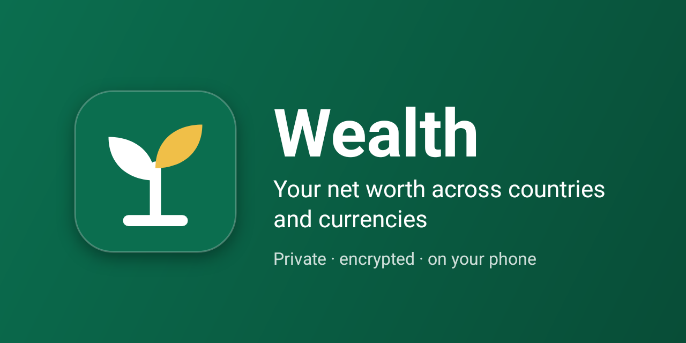
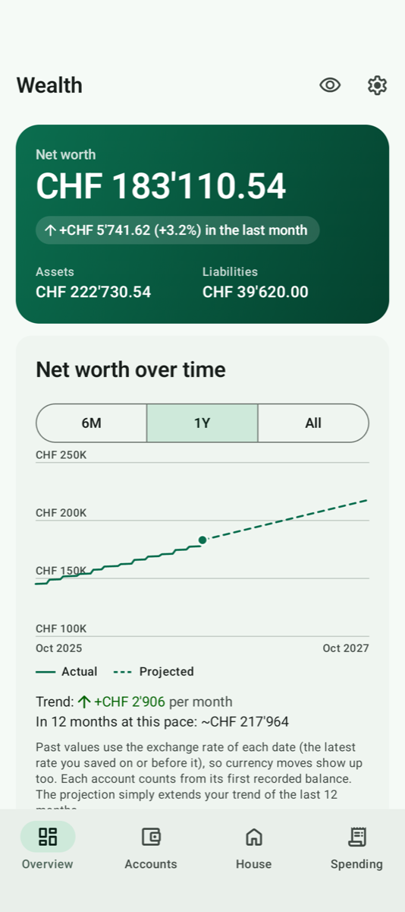
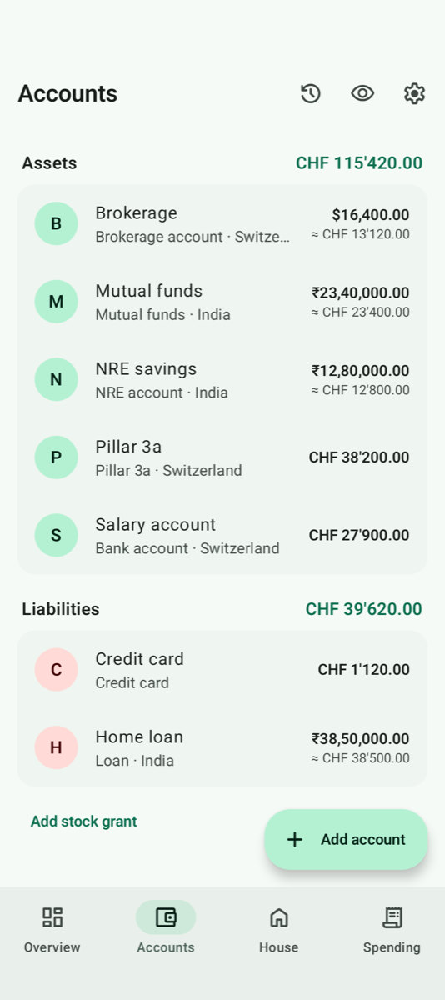
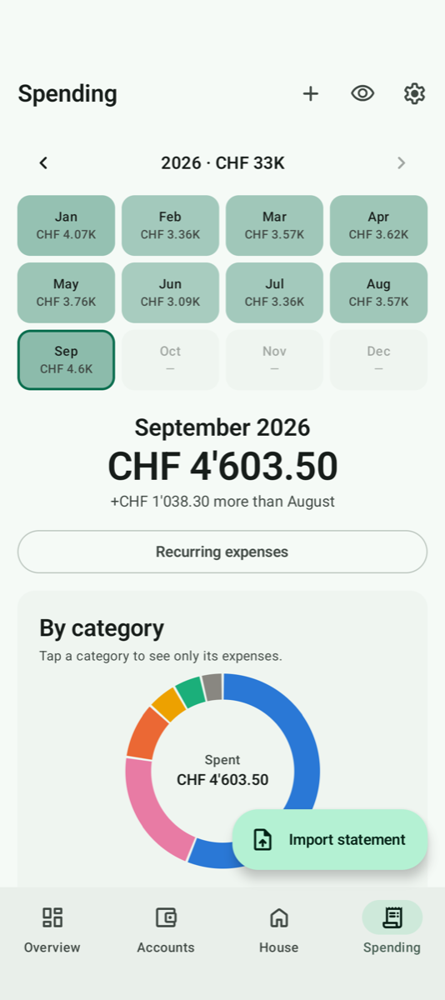
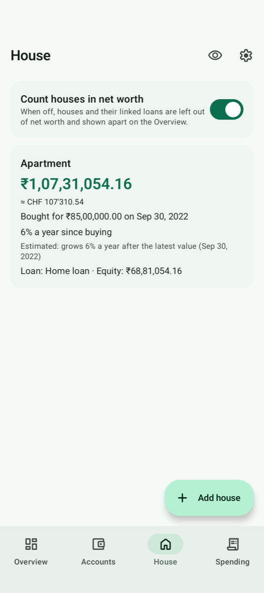
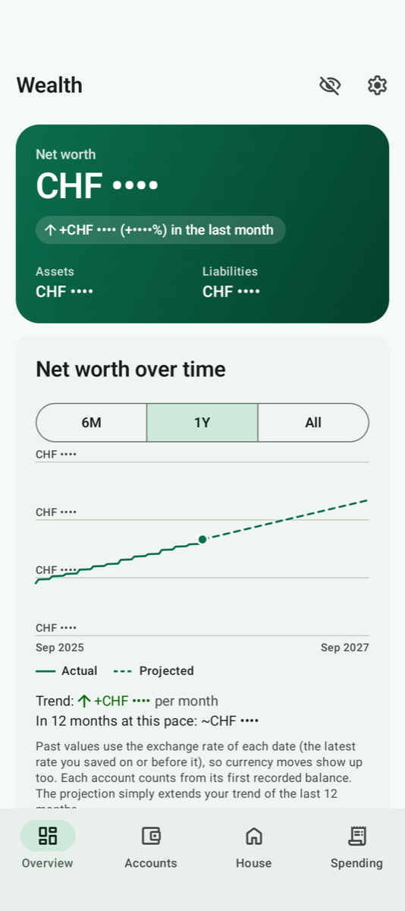
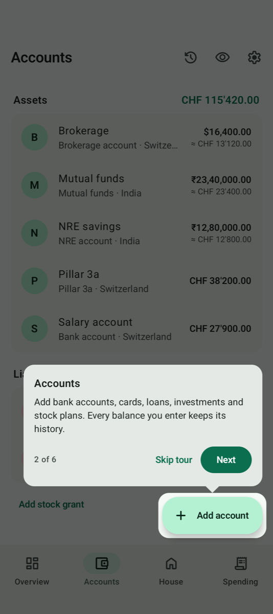

<p align="center">
  
</p>

# Wealth

A private Android app for your **net worth** and **spending** across countries
and currencies.

Built for people whose money lives in more than one place. For example,
someone from India working in Switzerland, with a salary and pension in CHF,
savings and funds in INR, and company stock in USD. Everything is
configurable, so any other mix of countries and currencies works just as
well.

**[Download the latest APK](../../releases/latest)** · Android 12 or newer

## Screenshots

<p align="center">
  
  
  
  
</p>
<p align="center">
  
  
</p>

<sub>Screenshots use made-up sample data.</sub>

## What's new

- **Transfers aren't spending:** each category has a "Counts as spending"
  switch (Settings › Expense categories). Money you move to your broker is
  already in your net worth, so a new default category, "Investments &
  transfers", is switched off. Its expenses leave the Spending totals and
  sit in one line you can open to see them.
- **Your order for categories:** drag ⋮⋮ in Settings › Expense categories
  to put them in the order you want; every category list follows it.
- **VIAC pillar 3a reports:** the monthly PDF reads straight into your
  history, one value per report. Pick many at once under "Build history
  from statements".

## Features

**Net worth, in one number**
- Every account keeps its own currency; totals show in the base currency you
  choose.
- **Exchange rates are downloaded daily** (European Central Bank, with a
  fallback source) for past dates too, so history uses each day's rate. A
  rate you type yourself is never overwritten.
- **Each amount in its currency's own style,** e.g. `CHF 1’234.50`,
  `₹12,34,567.00`, `$1,234.50`, with short chart labels like `₹12.5L`.
- **History chart** (6 months, 1 year, all) with a 12-month trend and
  projection.
- **Breakdown** by account type, country or currency, and **what changed**
  since last month.
- **Leave out any account** from net worth; it stays listed with its
  history.

**Accounts and liabilities**
- Bank accounts, pensions (e.g. Pillar 2/3a, EPF, PPF), investments, mutual
  funds, gold, cash, loans, mortgages and credit cards.
- Types, countries and categories come as editable defaults you can
  rename, delete or extend.
- Every balance you enter builds a history you can view and correct.
- **Company stock (RSU/GSU):**
  - a share account is valued as shares × daily price
  - grants show what's still unvested and when the next shares vest.
- **House tab:** a home's value grows from its purchase price and your
  estimates at a yearly rate. A linked loan shows your equity, and one
  switch counts houses in net worth or not.

**Spending**
- Monthly totals with a category chart, a comparison with the month before,
  and a year view of all months, shaded by how much you spent.
- **Import statements** (PDF or CSV). Rules sort expenses into categories,
  and duplicates and card-bill payments are skipped.
- Recurring expenses (rent, subscriptions) are added automatically on their
  day.

**Getting started**
- A short welcome screen (choose the currency to add everything up in), an
  optional tour of the main buttons, and a checklist that ticks itself off.
  Settings › Help shows the tour again.

**Build your history from old statements**
- Pick many statements at once. The app finds the right account for each,
  and adds month-end balances, closing balances or holdings values.
  Nothing is invented between statements.

**Supported statements** (anything else: CSV export with column mapping)

| Institution | Statement |
|---|---|
| UBS | Account statement (PDF), credit card invoice (PDF), card transactions report (PDF) |
| Swisscard | Credit card statement (PDF) |
| HDFC Bank | Account statement (PDF) |
| Morgan Stanley | StockPlan Connect quarterly statement (PDF) |
| Interactive Brokers | Activity statement (PDF) |
| Zerodha | Holdings export (.xlsx) |
| CAMS / KFintech | Mutual fund Consolidated Account Statement (PDF) |
| VIAC | Pillar 3a reporting (PDF) |

## Privacy and security

- **Your data stays on your phone.** There's no server, no account, no
  analytics and no ads.
- **The internet is used only to download** exchange rates (currency codes
  and dates are sent) and share prices (the stock symbol and dates are sent).
- **The database is encrypted** (SQLCipher). Its key is protected by the
  phone's secure hardware.
- **App lock:**
  - PIN or fingerprint, with a delay you choose
  - growing waits after wrong PINs
  - the PIN is stored as a slow hash tied to the phone's hardware key.
- **The app is blanked in the app switcher** (Android 13+), and figures can
  be hidden with the eye.
- **Backups are encrypted files you keep** anywhere, including Google Drive
  through the file picker, and are protected by a password you choose
  (AES-256). Android's own cloud backup is turned off, so nothing leaves
  your phone unless you export it.
- **If the phone ever loses the key to your data,** the app offers to
  restore a backup or start fresh. It never deletes anything.

## Install

1. On your phone, open [Releases](../../releases/latest) and download
   `wealth-x.y.z.apk`.
2. Open it and allow installing from your browser if Android asks.
3. **Updates** install over the previous version and keep your data. Every
   release is signed with the same key. The `.sha256` file next to the APK
   lets you check the download.

Make a backup (Settings › Backup) before updating, just in case.

## Build from source

Requirements: JDK 17 and the Android SDK. Android Studio installs both.

```bash
./gradlew assembleDebug
```

The APK is written to `app/build/outputs/apk/debug/`. Tests:

```bash
./gradlew testDebugUnitTest
```

## Tech

- Kotlin, Jetpack Compose (Material 3), MVVM with manual dependency
  injection, Navigation 3.
- Room with SQLCipher, and DataStore.
- kotlinx.serialization, and Android's own PDF text extraction.
- Tests:
  - JVM tests (Robolectric), including database upgrades and every backup
    format
  - device UI tests
  - black-box tests of the shrunk release build
  - an update check from the previous release.

## License

No license has been chosen yet, so all rights are reserved for now.
